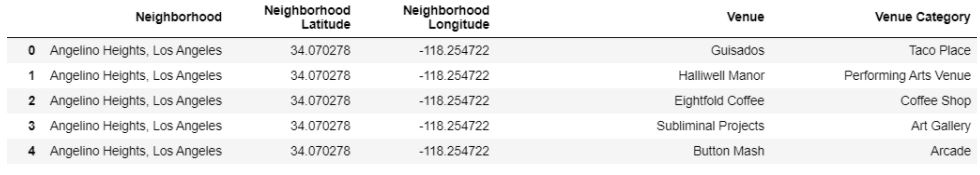

# Coursera_Capstone
--- 
I took the IBM Data Science courses on Coursera. This is the capstone project for the IBM Data Science certification. This project requires me to come up with an idea to leverage the Foursquare location data to explore or compare neighborhoods or cities of your choice or to come up with a problem that you can use the Foursquare location data to solve.  
I want to know if in Los Angeles, if someone is looking to open a coffee shop, where would I recommend that they open it?, so below I

* Scrapped data from Wikipedia websites and Foursquare API to get the geographical coordinates of the neighborhoods and top 100 venues of each neighborhood.
* Utilized EDA to explore the characteristics of the datasets and to choose a suitable algorithm (K-means) for the datasets.
* Provided insights and recommended the good locations based on the results.
* Made a presentation and wrote a report communicating the results to non-technical and technical audiences.

To get full codes, visit [my Github](https://github.com/4tiennguyen/Coursera_Capstone/blob/main/Final_Capstone_Project%20_SETTING_UP_A_NEW_COFFEE_SHOP_IN_LOS_ANGELES.ipynb)

----------------------------------------------------------------------------------------------------
# Introduction
Coffee is one of those drinks that a lot of people can’t do without. A good portion of the public starts their day with coffee, and many of them continue to drink it well past lunchtime and all through the day. According to the National Coffee Association USA, more than 450 million cups of coffee are consumed in the United States every day, and as much as 63% of American adults drink coffee daily. People have their coffee in two ways: making their coffee at home or going to a coffee shop. There are a lot of reasons people love to go to the coffee shop. Apart from getting a cup of coffee with the high-quality ingredients, best brewing recipes, consistency, fresh and appealing sweet & savory selections, people want to go to coffee houses because they want to meet up or gossip with their friends, do some work, read a book, entertain or simply to pass some time. Consequently, many businesses want to open a new coffee shop or expand their coffeehouse chain in the future.    

Opening a coffee shop can be extremely profitable if we do it right. The success of a coffee shop depends on many factors, and its location is one of them. In this project, we focus solely on the Los Angeles metropolitan area because it is also the most populated city in California. Being home and the workplace to many people, Los Angeles is considered a good place to start this business. However, “which neighborhoods in Los Angeles should a new coffee shop be located ?”   

In this project, data science methodology and one of the machine learning techniques (clustering) are used to assist our contractors/clients in finding a matching neighborhood to open a new coffee shop.

# Data Sets & Data Cleaning
There are two datasets in the project:
* neighborhoods in Los Angeles dataset scrapped directly from the Wikipedia website.
* Foursquare venue dataset crawled directly from Foursquare API.

To get the neighborhoods in Los Angeles, we used the BeautifulSoup package to scrape the Wikipedia website and then parsed the geographical coordinates of the neighborhoods using the neighborhood Wikipedia pages along with the Python Geocoder package which would give us the latitude and longitude coordinates of the neighborhoods. As a result, the Los Angeles dataset has 190 neighborhoods. For each neighborhood, the data consists of the neighborhood's latitude and longitude.  


After having the neighborhood's latitude and longitude data, we passed them to Foursquare API to get the top 100 venues that were within a radius of 2000 meters for those neighborhoods. As a result, the Foursquare venue dataset has 16909 observations where each observation consists of neighborhood latitude, neighborhood longitude, venue, and venue category.

In addition to the locality, the population in a neighborhood also plays an essential role in the decision of opening a new coffee shop. However, there is no such service providing the population of each neighborhood. Therefore, we assume that the more venues of a neighborhood, the more residents living there. After that, we classified the population into three categories depending on the number of venues that each neighborhood has as follows,
* Small population: the number of venues between 0 and 20 (exclusive)
* Medium population: the number of venues between 21 and 100 (exclusive)
* Large population: the number of venues of 100 or more


From the 3 tables above, the geographical coordinates are used to plot the map of Los Angeles with the neighborhoods while venue data is used to perform clustering on the neighborhoods. The number of coffee shops in each neighborhood is one of the most important features in the model. However, we don't want to set up a new coffee shop in a neighborhood that has a lot of coffee shops but less population. Therefore, we calculate the percent of coffee shops located in each neighborhood.

One more thing we should consider before calculating the percent of coffee shops located in each neighborhood is that we need to change all categories that are synonyms of Coffee to Coffee Shop such as “Café”.



# Methodology
### Exploratory data analysis
Before doing anything, let’s visualize a map of Los Angeles with neighborhoods superimposed on top.

There are about 416 unique venue categories in Los Angeles and coffee shops are at the top of the charts as we can see in the plot below. It’s about 1.5 times the second most common venue category (Mexican Restaurant) in Los Angeles areas.

The top 10 neighborhoods with the most number of coffee shops are shown in the bar chart below 


Edendale, which has 15 coffee shops, is the neighborhood that has the most number of coffee shops. Among the top 10 positions, Historic Filipinotown, Franklin Hills, Hancock Park, and Melrose Hill have the same number of coffee houses. 

Next, let visualize the bar chart about the population classification.

About 18 neighborhoods are having fewer than 60 venues which are considered a low population while there are about 110 neighborhoods that have more than 100 venues which implies that these neighborhoods have many residents.

### Clustering model
We performed K-mean clustering with the feature “Percent” in the table shown in figure 5 to cluster the neighborhood. K-mean algorithm is one of the most common cluster methods of unsupervised learning. To specify the number of clusters K, we used the elbow method.

We see that a good K to use in our model would be 3. We use the K-means algorithm in the sklearn library to fit clusters to our data.

# Results
From K-means clustering, cluster 0 has 78 neighborhoods which is the highest number of neighborhoods among the three clusters. Cluster 1 has 60 neighborhoods. Cluster 2 has 52 neighborhoods. The results from the K-means clustering show that we can classify the neighborhoods into 3 clusters based on the frequency of occurrence for ‘Coffee Shop’ among the venues:
* Cluster 0: Neighborhoods that have a moderate number of coffee shops. Each neighborhood has between 1 to 8 coffee shops. It takes 4% to 8% of the total of those neighborhoods’ venues.

* Cluster 1: Neighborhoods that have the fewest number of coffee shops. There are less than 8 coffee shops in each neighborhood. It takes 0% to 4% of the total of those neighborhoods’ venues.

* Cluster 2: Neighborhoods that have a high number of coffee shops. The number of coffee shops in each neighborhood is between 2 to 15. It takes 9% to 16% of the total of those neighborhoods’ venues.


We visualize the results of the clustering in the map with cluster 0 in red color, cluster 1 in blue color, and cluster 2 in yellow color.

# Discussion
The moderate and high percent number of coffee shops are concentrated in the center of Los Angeles. Cluster 1 (blue) has a very low percentage of coffee shops. This represents a great opportunity and high potential location to open a new coffee shop because there is very little to no competition to open a new coffee shop. As mentioned, the neighborhoods that have more than 100 venues are considered as large populations. From the graph below, we see that Reseda is a good neighborhood to set up a new coffee shop as it only has one coffee shop but it has a large population.


Cluster 0 can be chosen to open a new coffee shop if the population is large but the number of coffee shops is not too high (fig 13.) For example, Atwater Village has a large population but only 5 coffee shops. 


Lastly, neighborhoods in cluster 2 should be avoided setting up a new coffee shop since they already have a high concentration of coffee shops and may suffer from intense competition.

# Conclusion & Future Work
The purpose of this project is to assist our contractors/clients to find a neighborhood that their coffee shop should be set up in.

After fetching data from several data sources, processing them into a clean data frame, and applying the K-means clustering algorithm, we visualized and recommended potential neighborhoods that have a few coffee shops but have a large population. The finding of this project will help our contractors or clients to consider high potential locations while avoiding overcrowded neighborhoods in their decisions to open a new coffee shop.

Nevertheless, to open a coffee shop, we also need to consider other factors such as the cost of rent, the population of the neighborhood, etc. In this project, we classified the population of each neighborhood based on the number of venues in each neighborhood. Besides, this project made use of the free FourSquare API that came with limitations as to the number of API calls and results returned.  For future work, we can build a better recommendation if we have more fields and more data for our K-means clustering algorithm. 

# References
"List Of Districts And Neighborhoods In Los Angeles".En.Wikipedia.Org, 2020, https://en.wikipedia.org/wiki/List_of_districts_and_neighborhoods_in_Los_Angeles.

"Log In". Foursquare.Com, 2020, https://foursquare.com/developers/apps. 	
